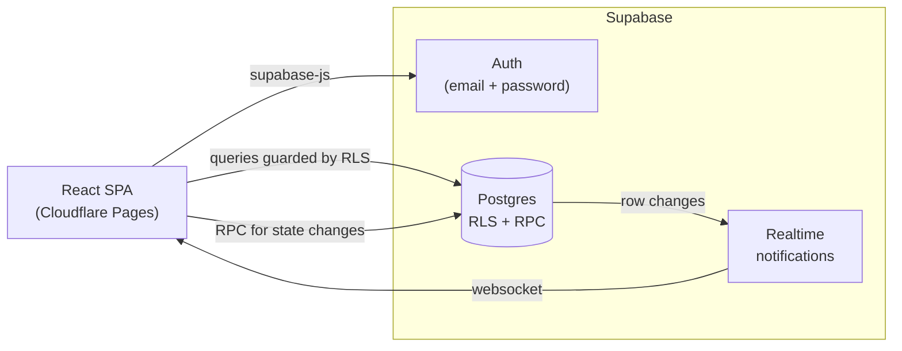
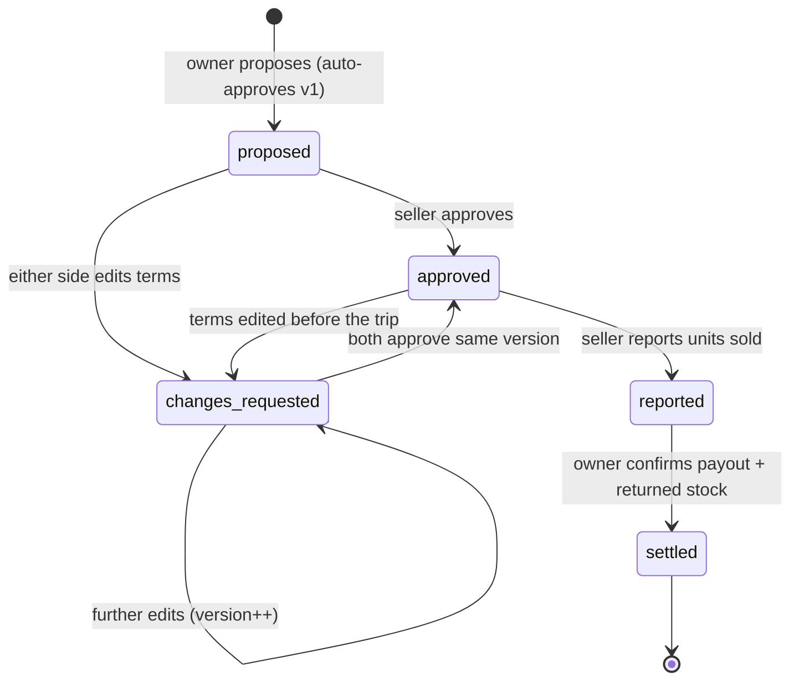

# Marketeers Club

A collaborative merchandise and consignment tracker. Friends form teams, post upcoming sales trips, and
lend each other merchandise to sell — with both sides approving the quantity, price, and commission
before anything changes hands.

Built as a single-page React app talking directly to Supabase. There is no custom backend server to
operate, so hosting cost and infrastructure surface stay minimal.

---

## Do I need Docker?

**No.** Docker is optional and only powers one workflow.

| Workflow | Docker required? | When to use |
| --- | --- | --- |
| **Hosted Supabase project** (recommended) | No | Normal development and all deployments |
| **Local Supabase stack** (`pnpm db:start`) | Yes | Offline work, or throwaway databases for risky migrations |

The hosted path is the default in every guide here. Create a free Supabase project in the browser, apply
the migration with `pnpm db:push`, and you never install Docker.

Docker only becomes relevant if you want to run Postgres, Auth, and the API locally on your own machine
via the Supabase CLI. If you are on Windows with WSL, that additionally requires enabling Docker
Desktop's WSL integration.

## Do I need to set up Supabase first?

Yes — the app needs a database and an auth provider. It takes a few minutes in the browser and is fully
scripted in the [Deployment Guide](docs/DEPLOYMENT.md#1-create-the-supabase-project).

The app fails gracefully in the meantime: if credentials are missing, the sign-in screen renders with an
explanatory notice and a disabled submit button rather than crashing. You can run `pnpm dev` right now
to see the UI shell before any Supabase setup exists.

---

## Tech stack

| Concern | Choice | Why |
| --- | --- | --- |
| UI | React 19 + TypeScript | Requested framework; strict typing across the data layer |
| Build | Vite 8 | Fast dev server, route-level code splitting |
| Routing | React Router 7 | Client-side routes with a shared app shell |
| Data / Auth / Realtime | Supabase | Postgres, email auth, and live notifications in one service |
| Package manager | pnpm | Strict, content-addressed installs |
| Hosting | Cloudflare Pages | Static hosting on a global CDN, generous free tier |
| Tests | Vitest | Same toolchain as Vite |

## Architecture



The browser holds only the **publishable anon key**. Every rule that matters is enforced in Postgres, so
a tampered client cannot bypass them:

- **Row Level Security** decides what each user can read. Inventory is readable only by its owner (plus a
  seller who has an agreement for that specific item), so teammates can search each other by display name
  without ever seeing each other's catalog.
- **`SECURITY DEFINER` functions** own every state transition — approvals, change requests, sales reports,
  and settlement. The `agreements` table grants only `select` and `insert` to users, so the approval
  workflow cannot be short-circuited with a direct `UPDATE`.
- **Money is stored as integer cents.** No floating-point drift in payouts or commissions.

## The agreement lifecycle

This is the core of the product. An agreement is a versioned contract; **any change to terms invalidates
the other party's approval**.



Inventory quantity is decremented **once**, at settlement, and only by the owner. Approval also checks
that uncommitted stock still covers the agreement, so the same items cannot be promised to two trips.

## Quick start

Requires Node.js 22.12+ and pnpm 10.

```bash
pnpm install
cp .env.example .env
pnpm dev
```

Fill `.env` with the values from your Supabase project:

```ini
VITE_SUPABASE_URL=https://your-project.supabase.co
VITE_SUPABASE_ANON_KEY=your-publishable-anon-key
```

Then apply the database schema (no Docker needed):

```bash
pnpm db:link    # choose your project, one time only
pnpm db:push    # applies supabase/migrations to the hosted database
```

Full walkthrough: [Deployment Guide](docs/DEPLOYMENT.md).

> `.env` is gitignored. Only ever put the **anon/publishable** key in it — the service role key must never
> reach the browser or the repository.

## Scripts

| Script | Purpose |
| --- | --- |
| `pnpm dev` | Vite dev server at `http://localhost:5173` |
| `pnpm build` | Type-check and build to `dist/` |
| `pnpm preview` | Serve the production build locally |
| `pnpm lint` | ESLint across the repo |
| `pnpm test` | Run unit tests once |
| `pnpm test:watch` | Watch mode |
| `pnpm check` | Lint + test + build (run before pushing) |
| `pnpm db:link` | Link the repo to a hosted Supabase project |
| `pnpm db:push` | Apply migrations to the linked project |
| `pnpm db:diff` | Diff local migrations against the linked project |
| `pnpm db:start` / `db:stop` / `db:reset` | Local Supabase stack — **requires Docker** |

## Project structure

```
src/
  App.tsx              Route table; authenticated pages are lazy-loaded
  auth.ts              Auth context + useAuth hook
  AuthProvider.tsx     Session provider (component-only, keeps Fast Refresh happy)
  components/          Layout shell and shared UI primitives
  domain/              Framework-free business rules (unit tested)
  lib/                 Supabase client and formatting helpers
  pages/               One screen per route
supabase/
  config.toml          CLI configuration
  migrations/          Schema, RLS policies, and workflow functions
public/_redirects      SPA fallback so deep links work on Cloudflare Pages
```

## Documentation

- [User Guide](docs/USER_GUIDE.md) — how to actually use the app, following the Ann and Bob scenario
- [Deployment Guide](docs/DEPLOYMENT.md) — Supabase setup and Cloudflare Pages deployment
- [AGENTS.md](AGENTS.md) — conventions for contributors and AI coding agents
- [ProjectOverview.md](ProjectOverview.md) — the original product brief

## Scale expectations

Sized for 10–50 users, up to ~100 item types each, inventories in the low thousands, and roughly 5–10
trips per person per year. That fits comfortably inside the Supabase and Cloudflare Pages free tiers.
